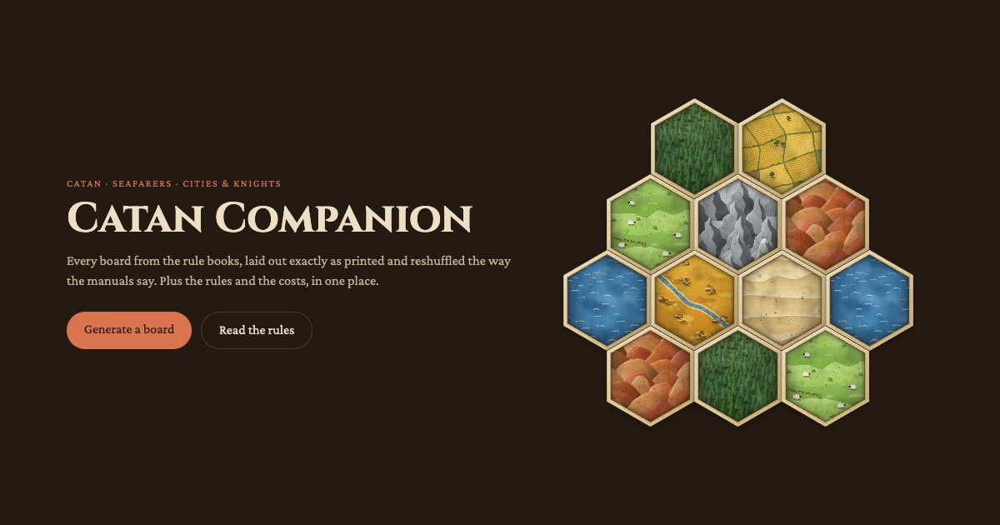

# Catan Companion

A companion for CATAN at the table, covering the base game, Seafarers and Cities & Knights
at 3-4 and 5-6 players.

**[Open the site](https://shounakdeshmukh.github.io/CatanCompanion/)**



## What it does

### Play: a banker's helper

Start a game from any generated board, then tap each dice roll and the page says who
collects what.

- Place settlements, cities, roads and ships by tapping the board. Only legal spots are
  offered, including the distance rule.
- The opening placements are walked through in order, and the second building's starting
  cards are listed.
- Tracks the robber and the pirate, knight cards and Road Building, Longest Road and
  Largest Army, and the score.
- Cities & Knights: commodities, knights on the board, the barbarian track and attacks,
  city improvements, walls and metropolises.
- Seafarers: ships, fog hexes revealed as they are explored, and cloth villages.
- 5-6 players: names the paired player each turn.
- A turn-by-turn history with what everything cost, dice statistics, and how lucky each
  player has been.
- Undo for any step. The game is saved on the device, so a refresh loses nothing.
- Shows how long each player's turns take, and can nudge a turn that runs long.
- Optional sound: dice, building, a seven, the barbarians, with a buzz on phones that can.
- Other phones can watch along read-only, by scanning a code.
- A finished game ends on a result card showing the final board, with a GIF replaying the
  game: the board being built, the dice and the scores. Both can be shared or saved;
  neither is kept on the device.

No dice? The page can roll for you.

### Map generator

Every board from the rule books, shuffled the way the rule books say.

- Optional fairness rules: no 6 and 8 touching, no matching numbers touching, a cap on
  same-terrain clumps, and more.
- A balance panel with pips per resource and the strongest spots to settle.
- Every board has a link that reproduces it exactly.

### Rules and cost cards

The rules in plain language, searchable across all three games, with a link for every
section. Cost cards cover buildings, ships, knights and city improvements.

## Running it

The project uses [bun](https://bun.sh).

```
bun install
bun run dev            # the site, at http://localhost:5173
bun test               # unit tests
bun run test:browser   # end-to-end checks in Chrome
bun run build          # the static site, in dist/
```

`bun run test:browser` needs Chrome or Chromium. Set `CHROME_PATH` if it is not in one of
the usual places.

Pushing to `main` builds the site and publishes it to GitHub Pages.

## How it is put together

A static site built with [Vite](https://vite.dev) and TypeScript, with no framework and no
server. Each page is its own HTML file.

- `src/data` holds the board layouts, the rules text and the costs.
- `src/lib` holds the logic, with the tests beside it: shuffling, board geometry, the game
  state and its history, and sharing.
- `src/pages` holds one script per page; `src/pages/play` has the Play page's panels.
- `tests/browser.mjs` drives a real browser through every map and through whole games.

A game lives entirely in the browser that is running it. Sharing with viewers connects the
phones to each other directly; see [NOTICE.md](NOTICE.md).

## Feedback

Found a mistake, or something that would make it more useful at your table?
[Open an issue](https://github.com/ShounakDeshmukh/CatanCompanion/issues/new).

## Licence and credits

GPL-3.0-or-later. See [LICENSE](LICENSE), and [NOTICE.md](NOTICE.md) for where the board
layouts come from.

Catan Companion is a fan-made reference. It is not affiliated with, endorsed by, or
sponsored by CATAN GmbH or CATAN Studio. CATAN is a trademark of CATAN GmbH.
